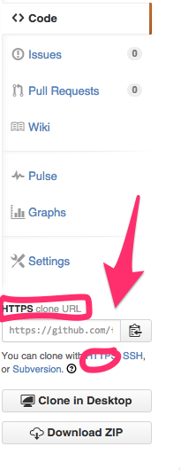

## Git Workshop Catch-Up

Did you miss class? No worries. Follow along with this workshop to learn how to use Github. 

### What is Github?

Google docs is a great way to store documents online and collaborate with other people on your work. Google docs is great for plain text, excel spreadsheets, and powerpoint presentations, but unfortunately for us, they don’t have a great way to store code. Github is the google docs of code. While there is a ton you can do with Github, today we’re just going to learn how to make a copy of a project located on Github.com and bring it down locally to your computer so you can work on it.

###Let's use Github!
The first thing you will need to do is some setup work to be able to use Github.com. Please go to the `Git Environment Setup` lesson in Ironboard and follow the instructions. Once you have completed those steps, come back here to finish out the lesson :)

Once you have finished setup, you'll want to the repository of this intro, by clicking the fork button in the top left corner of this page right by the name of the lesson. This link will take you to a Github.com site. This page on Github is the actual location of the code. 

The next step is to `fork` this repository. Forking is basically like photocopying a worksheet so that you have your own copy to work on. It's basically photocopying the lesson from Flatiron School's account and putting it in your Github account. To fork, you'll want to click the button that says `Fork` in the top righthand corner of the Github page.

A window should pop up asking you where you would like to fork this repository. You'll want to make sure to select your own Github account.

At this point, Github should refresh and you should be on a page that has your github username in the URL. Right now, this lesson still only exists on Github.com. You can't actually edit any of the text yet. It's not yet on your computer. The next step is to `clone` this repository, which means to bring the code from Github.com and put it on your computer.

On the right side of the screen, you'll want to look for the `Clone URL`. It should look something like this:

You want to make sure it says `HTTPS Clone url`. If it doesn't, click the link that says `HTTPS` found directly below. We even circled it for you guys.

Once you have the https url, you'll want to copy it. Then, in terminal in your development directory, you'll want to enter `git clone https_url_i_copied_from_github`. You'll want to replace `https_url_i_copied_from_github` with the actual https url you copied. This command, `git clone` will bring the repository from Github and save it on your computer. 

Terminal should prompt you to enter your Github username and password. When you type the password, you won't see the letters appear. I promise you're still typing, it's just a security thing. You'll want to hit enter after you enter both your username and password.

Once it finished cloning, you'll want to type `ls`. You should see a directory with the same name as the repository. In this case, `hs-git-code-along-catch-up`.

POW POW
